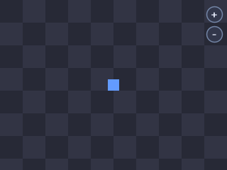

# Flix ゲーム スターターテンプレート

Flix でゲームを作るための最小の雛形です。星空に浮かぶアリーナで四角を動かす、
カメラ機能のミニマルなショーケース（追従・端で止まる境界・+/− ズーム・二層の視差・画面固定 UI）
が入っています。「ここから自分のゲームを育てる」ための骨組みです。



上の GIF は `make bake` が画面なしで生成したものです（World.step が純粋なので、
台本を畳むだけで実プレイと同じフレーム列が焼けます）。
見どころ: 右の壁まで歩く → カメラが星の余白の縁で止まる → 縁に沿って歩くと星と床の
速さがずれる（視差）→ ズームアウトでアリーナの全景 → 寄り直してループ。

しくみの解説は **[カメラのしくみ解説ページ](https://ababup1192.github.io/flix_ge_camera/camera-explainer.html)** にあります
（基礎用語・Flix の文法・コードと図の対比・触れる再現デモまで一式。
ソースは [docs/camera-explainer.html](docs/camera-explainer.html)、ローカルでもそのまま開けます）。

## 前提

必要なのは [devbox](https://www.jetify.com/devbox) を1つ入れることだけです。
JDK21・Flix コンパイラ・make は devbox が（内部で nix を使って）自動でそろえます。
自分で nix や JDK を入れる必要はありません。

## 始め方

このテンプレートを clone またはコピーして、フォルダの中でこう打ちます。

```sh
devbox run make run
```

初回は依存パッケージのダウンロードとコンパイルで少し時間がかかります。窓が開いたら成功です。

よく使うコマンド:

| コマンド | 何をするか |
|---|---|
| `devbox run make run`   | ゲームを起動する（窓が開く） |
| `devbox run make check` | 型検査だけ走らせる（一番速い確認） |
| `devbox run make build` | 実行できる形にビルドする |
| `devbox run make test`  | テストを実行する |

## 触る場所

ゲームのコードは `src/` にあります。役割はこの4つです。

- `src/World.flix` … ゲームの状態そのもの（いま何がどこにあるか）と、次の状態を作る規則。
- `src/Controls.flix` … キーの割り当て（どのキーで何をするか）。
- `src/View.flix` … 状態を絵に写す（何をどこに描くか）。
- `src/Main.flix` … 上の3つを App に繋いで起動する目次。

まずは `World.flix` の速度や色、`View.flix` の四角を変えてみると、感覚がつかめます。

`project.json` は窓の大きさ・背景色・使うフォントを決める設定ファイルです。

## GitHub テンプレートリポジトリとして使う

このテンプレートを GitHub のテンプレートリポジトリにしておくと、次の1コマンドで新しいゲームを複製できます。

```sh
gh repo create <あなたのゲーム名> --template ababup1192/flix-game-template
```

## 注記

このテンプレートは、エンジン本体（`flix_game_engine_full`）が GitHub Release に公開済みであることが前提です。
まだ公開されていない場合、依存のダウンロードに失敗して動きません。
